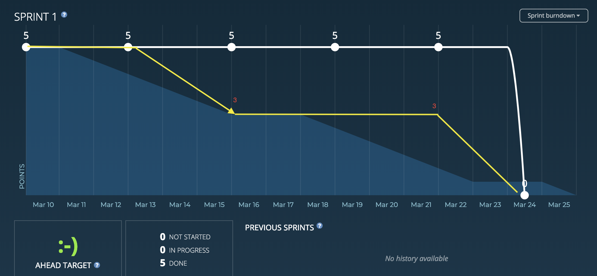
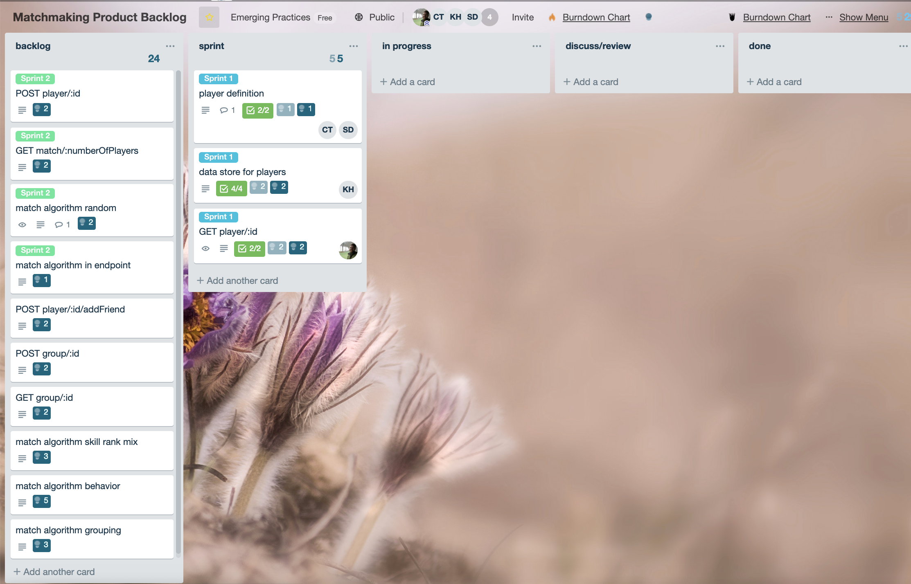
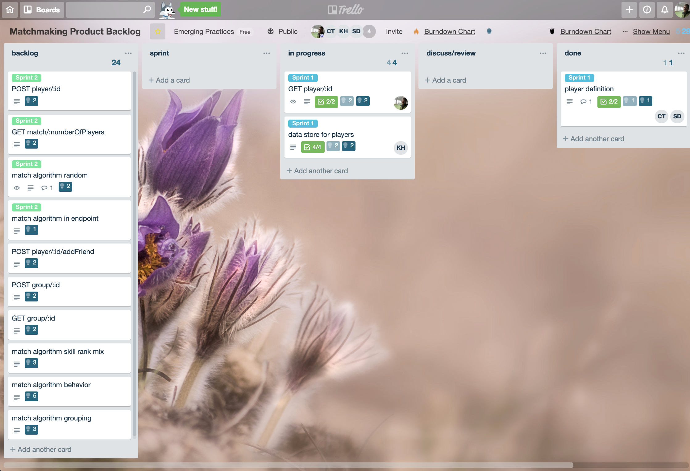
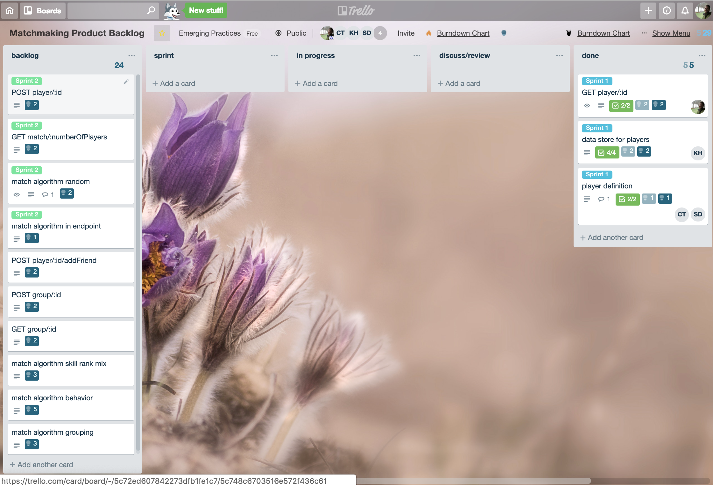

The burndown chart for this sprint had to be manually edited due to a glitch in the software used.

beginning of the sprint

middle of the sprint

end of the sprint

# 20190310
decisions
decided to do scrums MWF
decided to keep meeting minutes in github
decided to let individuals task their cards, doing it as a checklist on the card
.NET core using ms-sql

tasks
clarify in discussion if an API with demonstrated web requests is sufficient
clarify if mob/pair programming is required for all work
database standup
player definition
meeting minutes to github
populate burn-down data
put justification into github

30 pts for total project
3-5 hours per week per member
5 pts per week -> 10 pts per sprint
Sprint 1 MVP
GET request works locally for single player, hard-coded into store

friday at 8pm video scrum 
sundays at 1pm in person, video if decided in advance
daily scrum updates in slack, if progress is made, the day after by 10am

# 20190315
Kristin checked in initial commit of project with controllers and db server script
Others agreed to try and run the code for review

# 20190323
Discussed some developers issues with environment setup
Discussed that the application is serving the view which may cause issues consuming it as a service and did not follow the design laid out on the board.
The initial application will be great for using with the demo, but it makes it hard to mutate the model. We are looking into how to iterate on that tomorrow.
All PRs merged and initial application comitted
