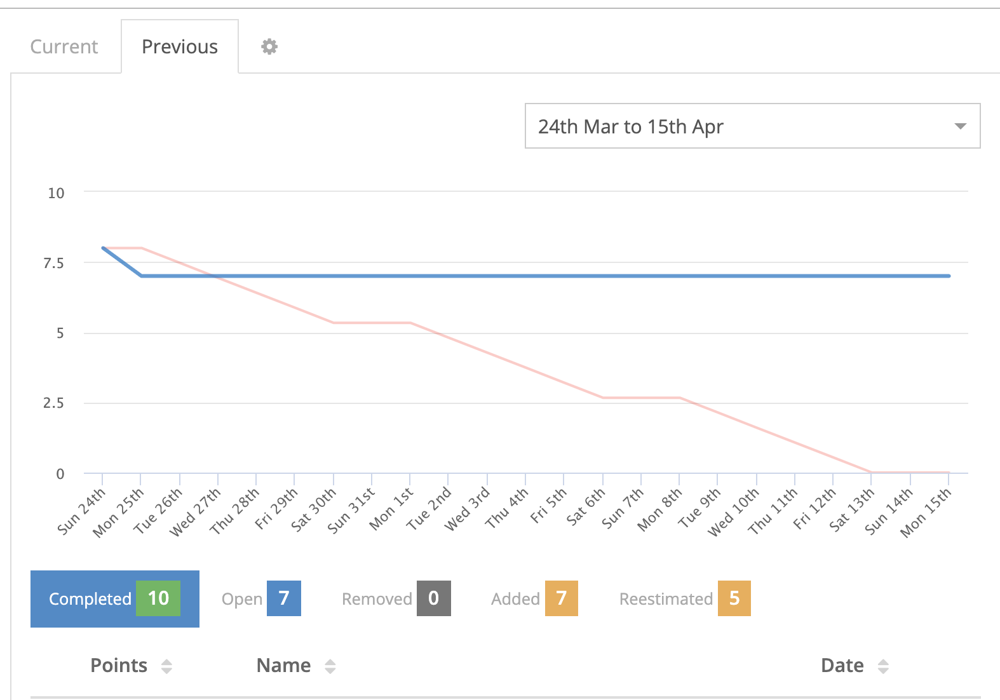
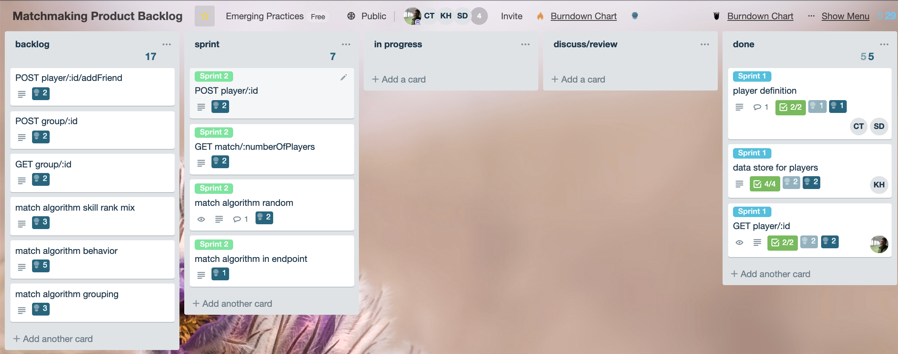
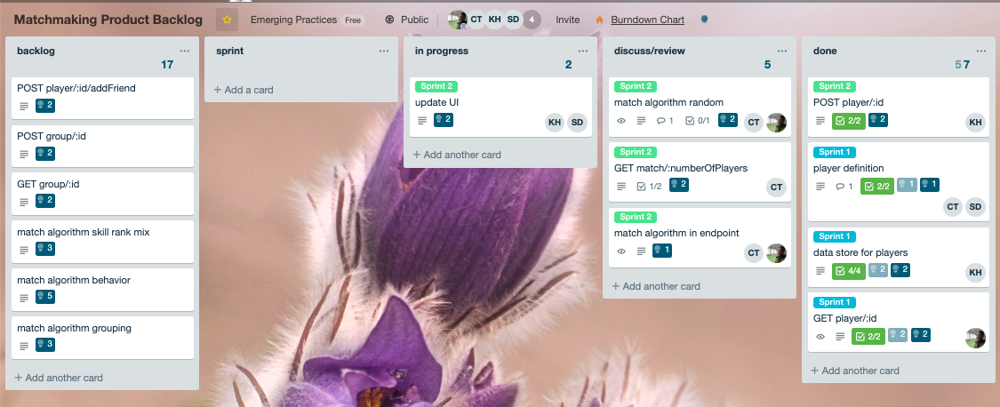
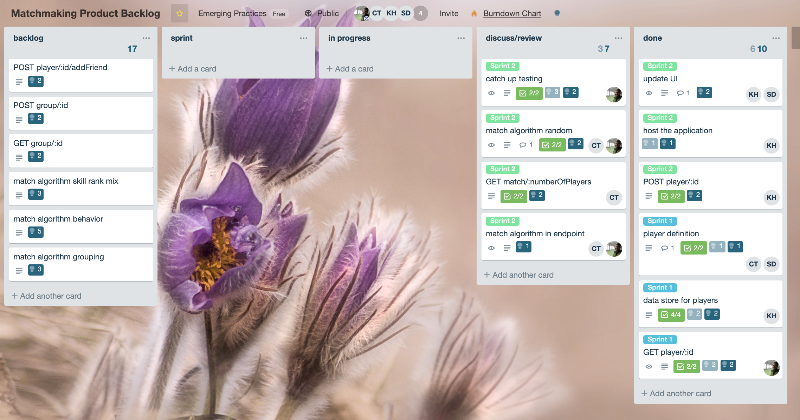

# Sprint 2

## Goal 

* retrieval of matched players

## Review

Overall the pace was consistent but the scope of the sprint expanded greatly adding additional testing and hosting the application, but despite this the tickets were mostly completed. Several tickets are still awaiting review however so the burdowns are largely skewed as that is technically counted as still in progress. The team needs to be better about revieiwing PRs.

To further complicate reporting the selected tool did not work well with a 3 week sprint. We are still having issues with trello tools after trying 3 different providers.

beginning of the sprint

middle of the sprint

end of the sprint

## Scrum minutes 

Additional daily scrums are in slack.

### 20190324

scrum kickoff

planned to capacity based on previous performance

set sprint goal

shifted focus from service api to a web front-end

### 20190329

Chris, Sourav, Martin

Martin expressed his contributions have been limited by the inability to use the project in an osx environment due to design decisions made by the team. he emphasized stating previously he was unable to develop in windows at the start of the project. he will continue to contribute with producing burndown charts and tracking the board as well as working to buddy code with other team members.

Sourav was able to get the app running locally. Suggested that we meet with professor and show him the current application to set expectations.

Chris added a match endpoint and pushed it to the repository

### 20190331
Martin, chris, sourav, kristin

further match endpoint work

Decided to create a new card to work on refactoring the UI. This was outside of original sprint scope but due to the current rate of progress we thought it prudent.

chris and martin collab on backend
kristin and souarev collab on fornt end redesign

### 20190407
Minutes for Apr 07, 2019

Taken by Chris Taylor

Present - Chris, Sourav

No significant status changes due to missing team members upcoming meeting with stakeholder tomorrow.

### 20190407
Met with stakeholder (prof) to discuss current status and targets.

Main outcome was to host application this sprint and focus more on a usable algorithm.

### 20190412
Taken by Chris Taylor

Present - Chris, Sourav, Kristin

Discussed plan to implement program on cloud infrastructure. Chris will do preliminary algorithm design. 

### 20190414
Present - Martin, chris

Supposed to be a sprint review meeting but not enough members present to be effective.

Martin
Able to get context mocked and tests written for the user controller. Currently have 3, plan on 20 by the end of the day. Please keep an eye on PRs.

Chris
Having some trouble with frameworks for views
Looked into elo and prepared for matching algorithm work
Martin: put some documentation into the folder that contains the algorithm class that explains elo. Maybe use a strategy pattern?

Discussed design of Matcher class

Merged open PR

### 20190426
Martin, Chris, Sourav, Kristin

Chris: Worked on PRs. Will be working on the algorithm.

Kristin: Working on UI. Will work on Login to fix issues with signup. Incorporate algorithm. 
Martin recommended doing a video demo in case there were issues during the live demo, Kristin said she didn’t want to do that.

Sourav: Worked on presentation. 

Martin: Fork merged to master, all PRs closed and merged, CI setup and badge added to repository. Will work on adding more tests and possibly an alternate CD for the main repository.

### 20190429
Martin, Chris, Sourav, Kristin

Chris: matchmaking algorithms merged in
Sourav: initial presentation completed
Martin: added to presentation and all tests finished
Kristin: incorporated matchmaking algorithm into UI

Sprint/product review
Team went over the previous sprints, discussed changes over time in goals and feature realignment
reviewed overall application
went over presentation plan