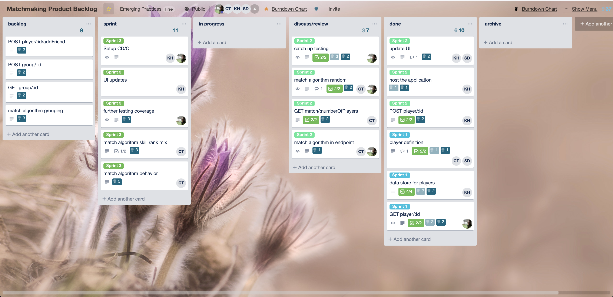
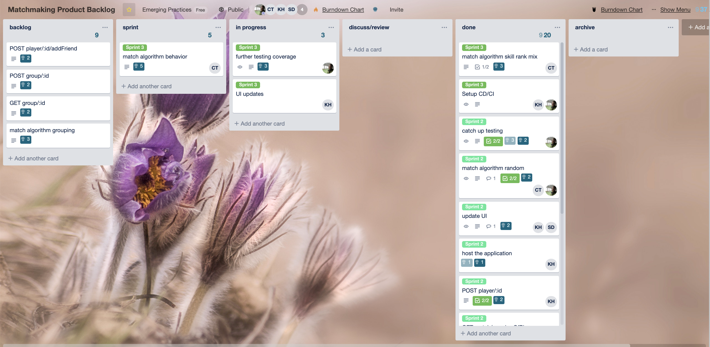
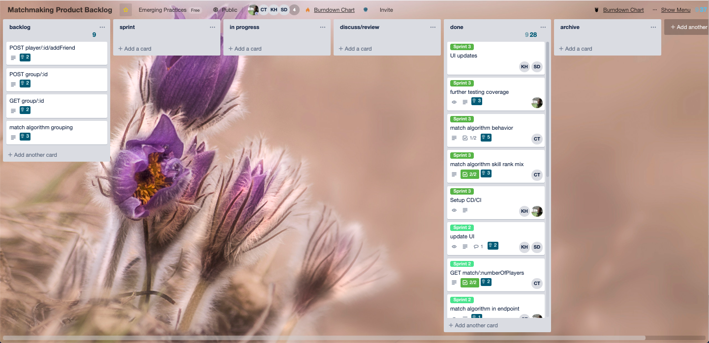

# Sprint 3

## Goal 

similar capacity picked for this sprint based on previous throughput and assuming we will do a better job of PRs.

* completion of sprint 2 outstanding reviews
* feature completion
* final application

## Review

Team went over the previous sprints, discussed changes over time in goals and feature realignment
reviewed overall application
went over presentation plan

beginning of the sprint

middle of the sprint

end of the sprint

## Scrum minutes 

Additional daily scrums are in slack.

# 20190419
Attendance: Martin, Chris

Discussed open testing PR. Has been open for a while.
Discussed open match PR, waiting on fixing changes form review to hopefully fix the broken view.

Martin: the application that was published was Kristin's fork. The changes there need to be merged to master via PR. Work should not be done in the forks (please), we need to work from feature branches in the main repo.

Sprint kickoff/planning/retro was missed last week so we did it today. Will review on Sunday with missing members.
Retro:
Burndown chart looked really bad due to amount of work still in review. Lets please try to be prompt on reviewing open PRs so they can be merged on time.
Planning:
Scoped down the work for the sprint to match previous discussions with stakeholders. Focusing on match features and leaving groups and friends as follow on work if time allows. Also added more test coverage work.

# 20190421
Chris, Martin

Went over new UI updates
Meeting on Tuesday set for CI/CD
Chris continuing work on matching algorithm, synced on return data
Adding user list back into UI to accommodate testing
Merging fork changes into master repo

# 20190426
Martin, Chris, Sourav, Kristin

Chris: Worked on PRs. Will be working on the algorithm.

Kristin: Working on UI. Will work on Login to fix issues with signup. Incorporate algorithm. Work on live demo.

Martin recommended doing a video demo in case there were issues during the live demo.

Sourav: Worked on presentation. Will continue to work on it this weekend. Will go over it in person at next meeting.
https://docs.google.com/presentation/d/1eBvsf4SeJzLRH6KwdEDspDUQuYFX4R_Xm-tedLnyjKU/edit#slide=id.g58d95a8361_0_455

Martin: Fork merged to master, all PRs closed and merged, CI setup and badge added to repository. Will work on adding more tests and possibly an alternate CD for the main repository.

### 20190429
Martin, Chris, Sourav, Kristin

Chris: matchmaking algorithms merged in
Sourav: initial presentation completed
Martin: added to presentation and all tests finished
Kristin: incorporated matchmaking algorithm into UI